# PawsConnect


---

## About

**PawsConnect** to mobilna platforma **adopcyjno-wolontariacka** (React Native / Expo), która łączy **schroniska** z **opiekunami i wolontariuszami**: przeglądanie zwierząt, ulubione, rezerwacje spacerów, wnioski adopcyjne oraz panel schroniska do ogłoszeń i obsługi wniosków.

---

## Widoki aplikacji (mockupy UI)

Poniżej zestawienie ekranów zgodne z plikami w katalogu [`docs/widoki/`](docs/widoki/). Zdjęcia służą jako **odniesienie wizualne** przy implementacji — przy kolejnych iteracjach można podmieniać pliki w `docs/widoki/` bez zmiany numeracji w README.

> **Uwaga:** Punkty **1–11** i **14** dotyczą głównie **użytkownika** (adoptujący / wolontariusz). Punkty **12–13** to **widok schroniska** (zarządzanie podopiecznymi i nowe ogłoszenie).

### 1 — Logowanie

Ekran startowy: logo, hasło przewodnie, formularz e-mail + hasło, przejście do rejestracji.

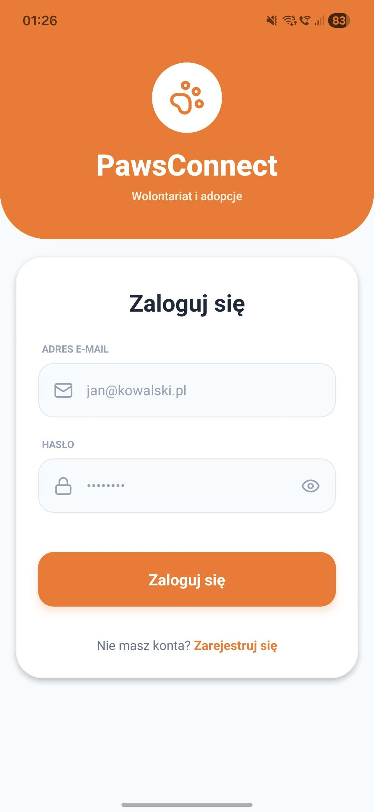

### 2 — Rejestracja konta

Wybór roli (np. „Szukam przyjaciela” / „Jestem schroniskiem”), pola danych kontaktowych i adresowych zgodnie z typem konta.

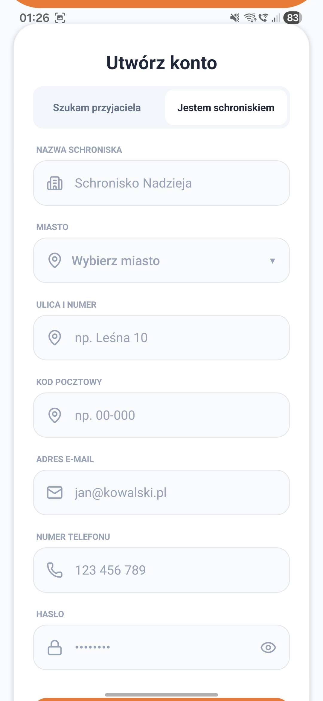

### 3 — Geolokacja i wybór miasta (API miejscowości)

Modal wyboru lokalizacji: wyszukiwarka miejscowości, przycisk **GPS**, opcja **„Cała Polska”** (bez filtrowania po konkretnym mieście). Integracja z geolokalizacją i źródłem danych o miastach.

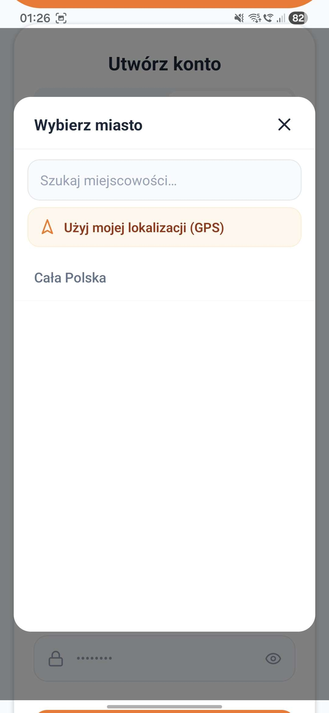

### 4 — Widok główny (lista zwierząt)

Filtr listy (np. zasięg / miasto), odniesienie do **dystansu od profilu**, wyszukiwarka, filtry zaawansowane, zakładki gatunków oraz karty zwierząt z odległością od punktu użytkownika.

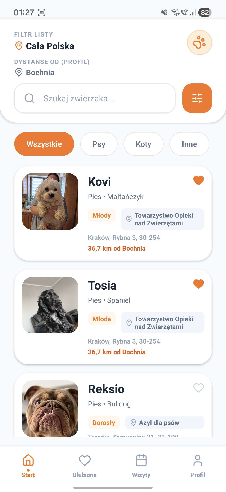

### 5 — Szczegóły zwierzaka

Po kliknięciu w kartę: zdjęcie, dane, lokalizacja schroniska, blok kontaktu, atrybuty (wiek, waga, kolor), akcje typu **spacer** / **adopcja**.

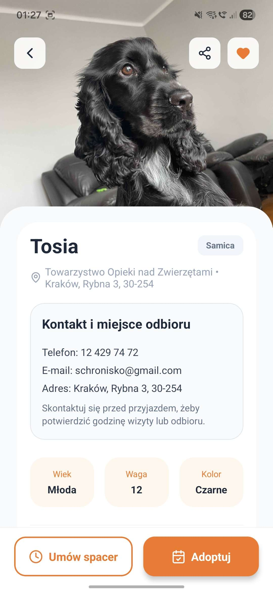

### 6 — Wniosek / rezerwacja spaceru

Formularz z datą i godziną, podsumowanie zwierzęcia, informacja dla użytkownika (np. czas trwania spaceru), przycisk wysłania rezerwacji.

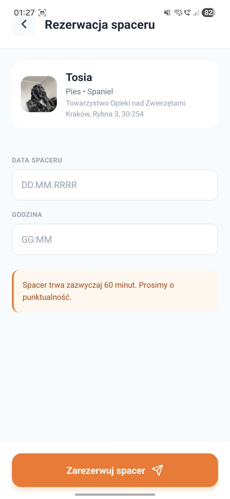

### 7 — Wniosek adopcyjny

Pole tekstowe z uzasadnieniem, dane schroniska, informacje o czasie odpowiedzi, wysłanie wniosku.

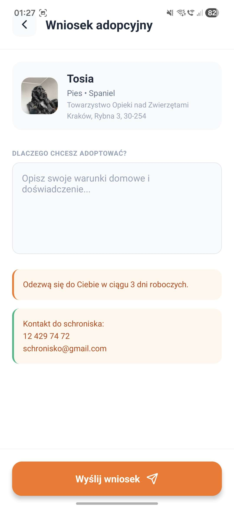

### 8 — Ulubione

Lista zapisanych zwierząt z tymi samymi skrótami informacji co na liście głównej.

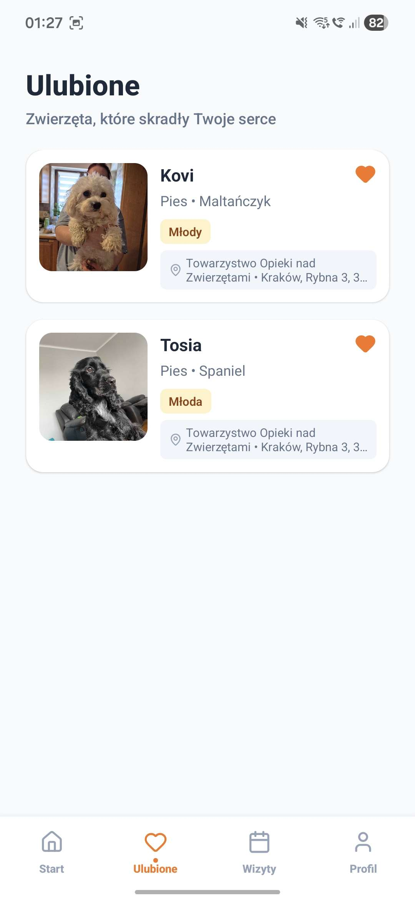

### 9 — Wizyty (statusy)

Zakładki **nadchodzące** / **historia**, karty wizyt ze statusem (np. oczekujące, zaakceptowane), szczegóły miejsca i kontaktu po akceptacji.

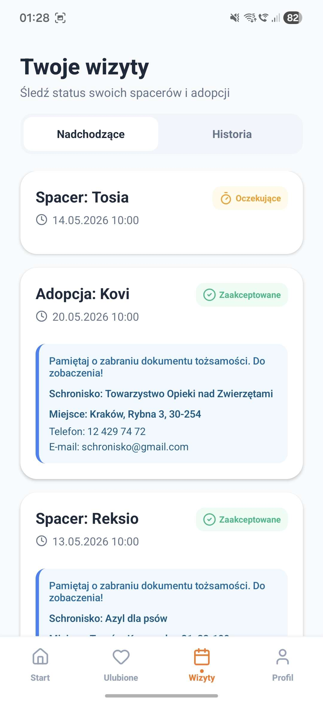

### 10 — Profil użytkownika

Nagłówek z avatarem i rolą, dane kontaktowe i lokalizacja, wylogowanie, nawigacja dolna.

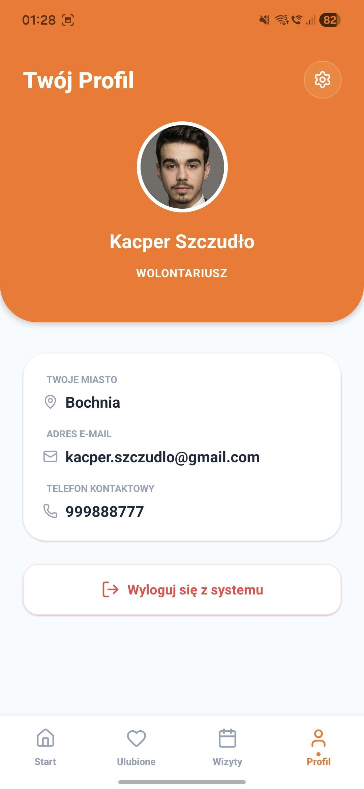

### 11 — Ustawienia konta / profilu

Edycja danych podstawowych, miasto, telefon, e-mail tylko do odczytu, zmiana hasła, zapis zmian.

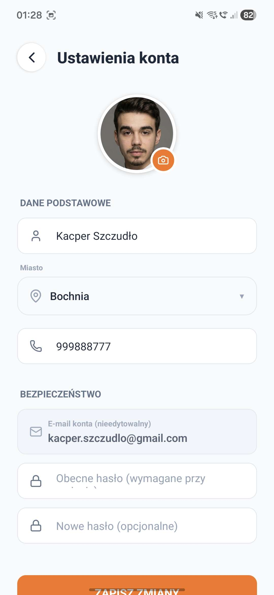

### 12 — Schronisko: lista podopiecznych

Widok **„Podopieczni”**: lista ogłoszeń schroniska, akcje edycji / usunięcia, wejście w formularz nowego zwierzaka.

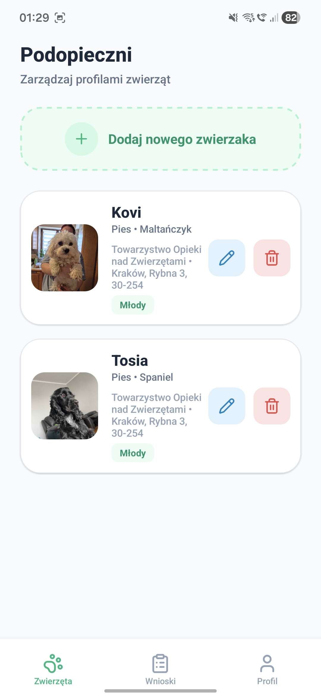

### 13 — Schronisko: nowe ogłoszenie (zwierzę)

Formularz dodania pupila: zdjęcie, imię, gatunek, płeć, wiek, dane schroniska z profilu, dalsze pola (waga, umaszczenie itd.).

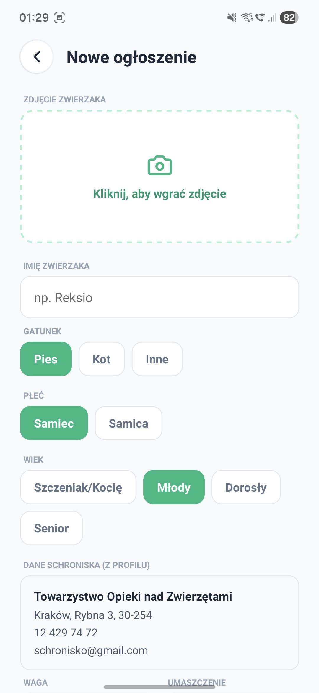

### 14 — Schronisko: wnioski (akceptacja / odrzucenie)

Lista wniosków (spacer, adopcja), dane zgłaszającego, status, akcje **akceptuj** / **odrzuć** (oraz ewentualnie zmiana terminu).

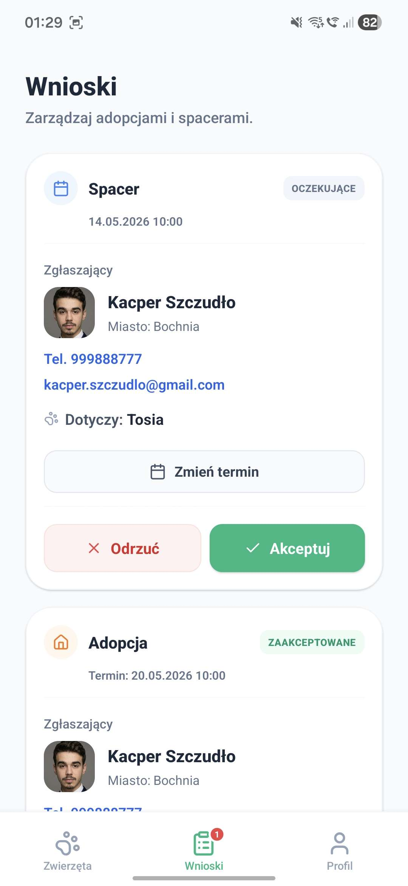

---

## Funkcje (skrót)

### Użytkownik

- Przeglądanie zwierząt z filtrowaniem (miasto / typ / dystans)
- Ulubione zsynchronizowane z bazą
- Wniosek adopcyjny i rezerwacja spaceru
- Lista wizyt (nadchodzące / historia) ze statusami
- Profil i ustawienia konta (w tym miasto, avatar)

### Schronisko (admin)

- Panel wniosków (adopcja + spacery), akceptacja / odrzucenie
- Zarządzanie podopiecznymi i dodawanie ogłoszeń
- Ustawienia profilu schroniska

---

## Stack technologiczny

- React Native + Expo
- TypeScript
- Zustand
- Supabase (PostgreSQL, Auth, RLS)

---

## Struktura projektu

```
PawsConnect/
├── docs/
│   └── widoki/              # mockupy UI (1.jpg … 14.jpg)
├── src/
│   ├── screens/             # ekrany aplikacji
│   ├── components/          # komponenty UI
│   ├── store/               # store Zustand
│   ├── services/            # klient Supabase, geokodowanie miast itd.
│   ├── utils/               # pomocnicze (np. dystanse)
│   └── navigation/          # nawigacja
├── app.json
├── tsconfig.json
├── package.json
└── README.md
```

---

## Uruchomienie lokalne

### Wymagania

- Node.js 16+
- Expo CLI
- Projekt Supabase

### Kroki

1. Zainstaluj zależności:

   ```bash
   npm install
   ```

2. Utwórz plik `.env` w katalogu głównym:

   ```bash
   EXPO_PUBLIC_SUPABASE_URL=https://your-project.supabase.co
   EXPO_PUBLIC_SUPABASE_ANON_KEY=your-anon-key
   ```

3. Uruchom aplikację:

   ```bash
   npm start
   ```

---

## Baza danych (Supabase)

Tabele m.in.:

- `animals`
- `applications`
- `favorites`

Włączone jest RLS. Użytkownicy widzą własne ulubione i wnioski; administratorzy schroniska obsługują wnioski zgodnie z regułami dostępu.

---

## Licencja

MIT
